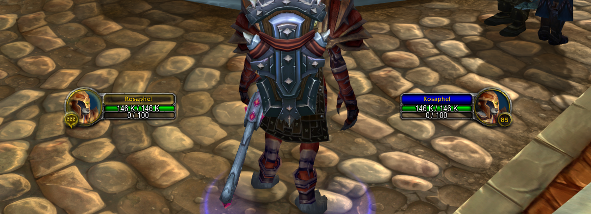

# wowframeadj

`wowframeadj` is a command-line utility for inspecting and updating `layout-local.txt` files used by World of Warcraft to define UI frame layout positions.

This tool is designed to be fast, scriptable, and minimally invasive.

## Features

- Parse and read `layout-local.txt` files
- Display a summary table of frame configurations
- Update one or more properties of a specific frame
- Writes changes directly back to the file
- CLI-friendly and automation-ready

## Requirements

- Python 3.8 or higher
- No external dependencies

## Installation

No install necessary. Just clone or download and run the script directly.

```bash
git clone https://github.com/EricaPomme/wowframeadj.git
cd wowframeadj
python main.py /path/to/layout-local.txt
````

## Usage

### Display Frame Summary

```bash
python main.py /path/to/layout-local.txt
```

This will output a clean table of all frames and their current properties, with the `Frame` name listed first and other keys sorted alphabetically.

### Update a Frame

To modify a frame, use the `--set` flag and specify at minimum the `Frame` name, followed by any properties you want to override:

```bash
python main.py /path/to/layout-local.txt --set Frame=MyAddonFrame X=100 Y=-200 Anchor=TOPRIGHT
```

Only the specified properties will be changed. The rest of the file will be preserved and written back in-place.

### Valid Keys for `--set`

* `Frame` (required)
* `Anchor`
* `FrameLevel`
* `X`
* `Y`
* `W`
* `H`

All values are automatically cast to integers or floats when appropriate.

## Examples

### Set player and target frames to a more visible "HUD" position for all characters on Classic

```powershell
Get-ChildItem -Path "C:\Program Files (x86)\World of Warcraft\_classic_" -Recurse -Filter "layout-local.txt" | ForEach-Object {
     $x, $y = 300, -220
     python main.py $_ --set Frame=PlayerFrame X=-$x Y=$y
     python main.py $_ --set Frame=TargetFrame X=$x Y=$y
}
```

### Frame layout overview for all Characters
```powershell
Get-ChildItem -Path "C:\Program Files (x86)\World of Warcraft\_classic_" -Recurse -Filter "layout-local.txt" | ForEach-Object {
    ($_ -split '[\\/]')[-3..-2] -join '\'
    python main.py $_
    "`n"
}
```
```txt
Mankrik\Mebh
Frame                | Anchor   | FrameLevel | H   | W   | X    | Y   
---------------------|----------|------------|-----|-----|------|-----
PlayerFrame          | CENTER   | 1          | 100 | 232 | -300 | -220
TargetFrame          | CENTER   | 1          | 100 | 232 | 300  | -220
WorldMapScreenAnchor | TOP      | 0          | 1   | 1   | -332 | -140
WorldMapFrame        | CENTER   | 1          | 438 | 610 | -28  | 25  


Mankrik\Rhodwynd
Frame                | Anchor   | FrameLevel | H   | W   | X    | Y   
---------------------|----------|------------|-----|-----|------|-----
PlayerFrame          | CENTER   | 1          | 100 | 232 | -300 | -220
WorldMapScreenAnchor | TOP      | 0          | 1   | 1   | -332 | -140
WorldMapFrame        | CENTER   | 1          | 438 | 610 | -28  | 25  
TargetFrame          | CENTER   | 1          | 100 | 232 | 300  | -220


Mankrik\Rosaphel
Frame                | Anchor   | FrameLevel | H   | W   | X    | Y   
---------------------|----------|------------|-----|-----|------|-----
PlayerFrame          | CENTER   | 1          | 100 | 232 | -300 | -220
WorldMapScreenAnchor | TOP      | 0          | 1   | 1   | -332 | -140
WorldMapFrame        | CENTER   | 1          | 438 | 610 | -28  | 25  
TargetFrame          | CENTER   | 1          | 100 | 232 | 300  | -220
```
---
